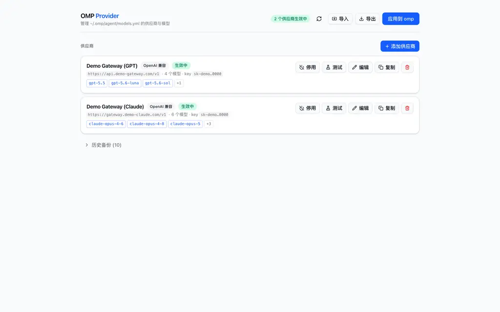
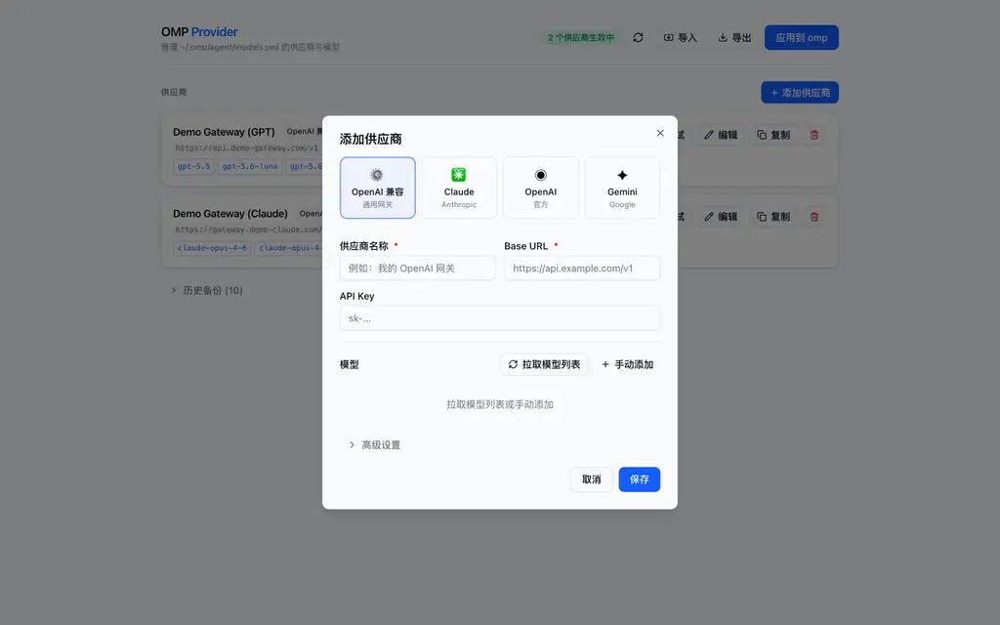

# omp-switch

> 为 [Oh My Pi](https://omp.sh)（OMP）打造的供应商 / 模型配置图形化管理器，一键切换上游供应商。

[](LICENSE)

omp-switch 是一个本地运行的 Web 应用：通过浏览器管理 `~/.omp/agent/models.yml` 中的供应商（Provider）与模型配置。**所有数据只存在本机，不上传任何服务器**——浏览器只是操作界面，真正的文件读写由本地服务完成。

参考 [CC Switch](https://github.com/farion1231/cc-switch) 与 [CLIProxyAPI](https://github.com/router-for-me/CLIProxyAPI) 生态的功能设计，界面采用 shadcn/ui 组件库。

## 为什么需要它

在 OMP 中手动编辑 `models.yml` 配置多个供应商（官方 API、中转网关、多账号组）时：

- 每次切换供应商都要改文件、记备份，容易出错
- 模型列表要手抄，思考级别映射（`reasoningEffortMap`）容易配错
- 上游挂了只能靠报错猜，没法快速验证连通性

omp-switch 把这些变成可视化操作：**在编辑区选择下次生效的供应商、一键拉取模型列表、测速验证连通性、自动备份可恢复**。

## 功能特性





- **供应商管理**：增删改查、加入/移出下次应用、复制（同网关换 Key 的高频场景）
- **类型驱动添加**：OpenAI 兼容 / Claude / OpenAI 官方 / Gemini 四种预设，自动预填 Base URL 与 API 协议
- **拉取模型列表**：自动从 `/v1/models` 拉取（含候选端点回退），复选框勾选添加，已配置模型自动预勾选；编辑已有供应商时直接使用服务端存储的 Key，无需重复输入
- **模型配置**：上下文窗口、最大输出、思考设置（模式/最低/最高级别）、**思考级别映射**（omp 内部级别 → 供应商实际值，如 GLM 的 `minimal → none`）、compat 高级配置
- **连通性测试**：按协议（chat/completions / messages / responses / generateContent）发送真实请求；流式协议显示首字延迟 TTFT，非流式协议显示响应耗时
- **应用与恢复**：一键写入 models.yml，应用或恢复前自动保存当前版本（保留最近 10 份）；恢复时同步编辑区，避免下次应用覆盖恢复结果
- **导入导出**：从当前 models.yml 导入、导出 YAML
- **安全**：API Key 只写入本机 `providers.json` 和 OMP 的 `models.yml`（权限 600），界面和状态接口仅显示掩码；服务只监听 `127.0.0.1`

## 快速开始

### 方式一：桌面应用（推荐）

从 [Releases](https://github.com/llt22/omp-switch/releases) 下载对应平台的安装包，安装后直接运行：

| 平台 | 安装包 |
|---|---|
| macOS (Apple Silicon) | `omp-switch_*_aarch64.dmg` |
| macOS (Intel) | `omp-switch_*_x64.dmg` |
| Windows | `omp-switch_*_x64.msi` |
| Linux | `.deb` / `.AppImage` |

应用启动本地服务（127.0.0.1:8642）并打开原生窗口，支持系统托盘常驻（关闭窗口 = 隐藏到托盘，服务继续运行）。首次启动会自动从你现有的 `~/.omp/agent/models.yml` 导入供应商。

#### macOS 首次打开（未签名应用的 Gatekeeper 提示）

CI 构建的应用使用 Ad-hoc 签名，避免不完整签名被误报为“已损坏”；由于没有付费 Apple Developer ID 和公证，macOS 首次打开时仍可能阻止运行。处理方式二选一：

- **一键安装脚本**（推荐）：下载 dmg 后将 `omp-switch.app` 拖到下载目录，执行：

  ```bash
  bash scripts/install-macos.sh
  ```

- **手动**：右键点击应用 → 打开 → 再点"打开"；或终端执行：

  ```bash
  xattr -dr com.apple.quarantine ~/Downloads/omp-switch.app
  ```

### 方式二：直接运行二进制（无桌面环境）

```bash
git clone https://github.com/llt22/omp-switch.git
cd omp-switch
bun server.ts    # 或编译后的单文件二进制
```

浏览器自动打开 `http://127.0.0.1:8642`。

### 方式三：从源码构建

```bash
# 后端（零依赖，仅需 bun）
bun server.ts

# 单文件二进制（内置全部依赖与页面）
bun build --compile server.ts --outfile omp-switch

# 前端开发（React 19 + Tailwind v4 + shadcn/ui）
cd web
bun install
bunx vite build        # 产物输出到 web/dist，由 server 托管
bunx vite dev          # 开发模式（默认 5173 端口）

# 质量检查（项目根目录）
cd ..
bun test
bun run typecheck
cargo check --manifest-path tauri/Cargo.toml
```

> 二进制为当前平台编译（Apple Silicon / Linux x64 等），跨平台分发需在目标平台重新编译。
> 桌面应用版本以 `tauri/Cargo.toml` 为唯一来源，Tauri 打包配置会自动读取该版本。

## 使用指南

### 添加供应商

1. 点击「＋ 添加供应商」
2. 选择类型（OpenAI 兼容 / Claude / OpenAI / Gemini），自动预填 Base URL 与协议
3. 填写名称（自动生成 Provider ID，可手动修改）、Base URL、API Key
4. 点击「拉取模型列表」勾选模型，或手动添加
5. 保存

### 切换供应商

卡片上的「加入 / 移出」控制供应商是否参与下次应用。调整后页面会持续提示存在未应用更改；点击顶部「应用到 omp」才会写入 `models.yml`。每次应用或恢复前都会自动保存当时的配置，可在「可恢复版本」中恢复。

### 测试连通性

卡片上点击「测试」，工具会发送一次可能产生少量费用的真实请求。流式协议返回首字延迟（TTFT）与总耗时，非流式协议返回响应耗时；401/403 会明确提示凭证无效。

### 思考级别映射

omp 内置思考级别：`minimal / low / medium / high / xhigh / max`。如果供应商对级别的叫法不同（例如 GLM 用 `none` 对应 `minimal`），在模型编辑的「级别映射」中填写；输入框提供常见级别下拉建议，也可以直接填写供应商自定义值，叫法一致时留空即可。上下文窗口可从常见规格中快速选择，也保留精确数字输入。

## 架构

```
┌─────────────────┐   HTTP    ┌──────────────────┐   读写   ┌──────────────────────┐
│  浏览器 (UI)     │ ────────▶ │ server.ts (bun)  │ ───────▶ │ ~/.omp/agent/        │
│  React + shadcn │ ◀──────── │  127.0.0.1:8642  │          │   models.yml         │
└─────────────────┘           └──────────────────┘          │   backups/           │
      web/dist（构建产物由 server 托管）                       └──────────────────────┘
```

- `server.ts`：bun 单文件后端，负责 API、YAML 序列化、模型拉取、流式测速、文件读写与备份
- `web/`：React 19 + Vite + Tailwind CSS v4 + shadcn/ui 前端
- `providers.json`：本地供应商数据（含 Key，权限 600，已 gitignore）

## 安全说明

- API Key 明文仅存于本机 `providers.json` 和 OMP 使用的 `models.yml`（均 `chmod 600`），界面与状态 API 只返回掩码
- 服务仅绑定 `127.0.0.1`，外部网络无法访问
- 拉取模型列表在服务端完成，Key 不会出现在浏览器网络请求中

## Roadmap

- [ ] 供应商批量测速对比
- [ ] 应用前配置差异预览
- [ ] 多机配置同步（加密导出/导入）

## 致谢

- [CC Switch](https://github.com/farion1231/cc-switch) —— 供应商卡片、预设模板、备份轮换的设计参考
- [CLIProxyAPI](https://github.com/router-for-me/CLIProxyAPI) —— 类型驱动添加、模型拉取、流式健康检测的设计参考
- [shadcn/ui](https://ui.shadcn.com) —— 组件库
- [Oh My Pi](https://omp.sh) —— 本项目服务的对象

## License

[MIT](LICENSE)
